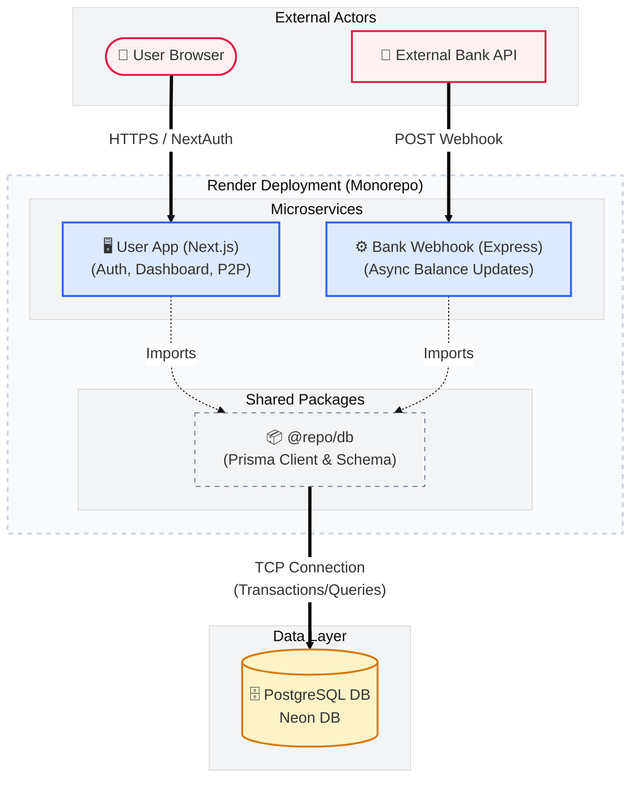

# 💸 PayTM-like App: Full-Stack Payments Monorepo

A high-performance, distributed payments platform built with **Next.js**, **Node.js**, and **PostgreSQL**. This project features a decoupled architecture, secure P2P transfers, and an automated bank-webhook processing system.

## 🚀 Technical Highlights

- **Monorepo Architecture:** Managed via **Turborepo** and **npm workspaces** to optimize build pipelines and enable seamless code sharing across frontend and backend services.
- **Decoupled Microservices:** Independent deployment of the **User-App** (Next.js) and **Bank-Webhook** (Express) for optimized scaling on **Render**.
- **Atomic Transactions:** Leverages **Prisma Transactions** to ensure ACID compliance during wallet balance updates and P2P transfers.
- **Security Migration:** Successfully transitioned from plaintext storage to **Bcrypt hashing**, implementing a hybrid "auto-upgrade" logic to secure legacy user data.
- **CI/CD & DevOps:** Automated deployment pipelines using **GitHub Actions** and **Docker** to ensure environment parity and streamlined service updates.

## 🛠️ Tech Stack

- **Frontend:** Next.js 14 (App Router), Tailwind CSS, NextAuth.js
- **Backend:** Node.js, Express.js, TypeScript
- **Database:** PostgreSQL, Prisma ORM, Neon DB
- **Infrastructure:** Docker, Render, GitHub Actions, Turborepo

---

## 🏗️ System Design

The application is split into two primary services that share a common database schema and shared TypeScript types:

1.  **User-App:** Handles the UI, user authentication, dashboard visualization, and P2P transfer requests.
2.  **Bank-Webhook:** A "headless" service that listens for external bank notifications to fulfill "Add Money" requests asynchronously.

---

## 🏗️ System Architecture



## 🚦 Getting Started

### Prerequisites

- Node.js (v18+)
- Docker (Optional)
- PostgreSQL instance (or Neon DB account)

### Installation

1.  **Clone the repository:**

    ```bash
    git clone https://github.com/rah7202/paytm.git
    cd paytm
    ```

2.  **Install dependencies:**

    ```bash
    npm install
    ```

3.  **Setup Environment Variables:**
    Create a `.env` file in the root and add your `DATABASE_URL` and `NEXTAUTH_SECRET`.

4.  **Database Migration & Seeding:**

    ```bash
    npx prisma migrate dev
    npx prisma db seed
    ```

5.  **Run the application:**
    ```bash
    npm run dev
    ```

---

## 🐳 Docker Deployment

To run the entire ecosystem (Frontend, Backend, and DB) locally using Docker:

```bash
docker-compose up --build
```
